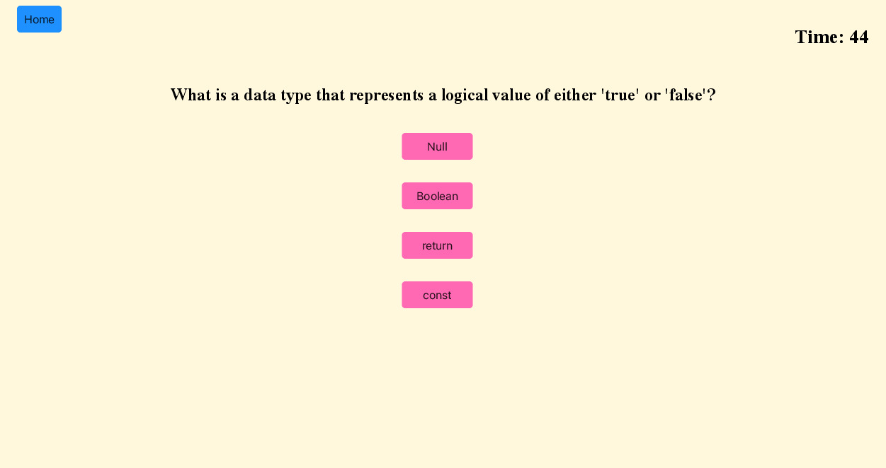

# Berkeley Coding Bootcamp Challenge 4
4th coding bootcamp challenge where students were asked to create a timed quiz on JavaScript fundamentals that stores high scores. 

The live version of this project can be accessed at: https://ojds2022.github.io/coding_quiz/

